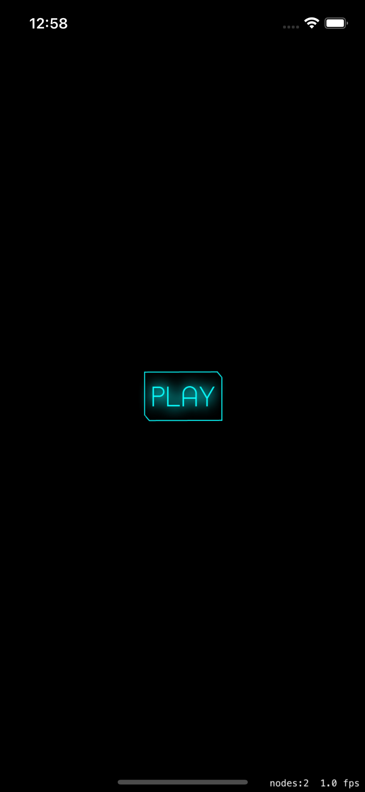
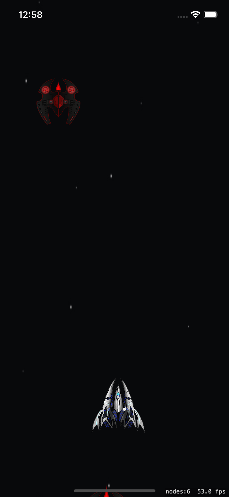

# Space Shooter 🚀

A simple 2D space shooter game built with Swift and SpriteKit.

> ⚠️ This project is in early development.  
> So far, it includes:
> - A neon-style start screen with a PLAY button  
> - A playable endless shooter screen  
> - Player spaceship with touch movement  
> - Bullet firing with working collision (enemy hit = explosion)  
> - Enemies spawn randomly and move downward  
> - Scrolling background effect

❌ No score, no health, and no player-enemy collision yet.

---

## ▶️ Getting Started

1. Open `SpaceGame.xcodeproj` in Xcode  
2. Build & Run on a simulator or physical device

---

## 📸 Screenshots

  
  

<i>Start screen and gameplay demo from iOS simulator</i>

---
## 🔄 Roadmap

- [x] Start screen  
- [x] Enemy spawn & movement  
- [x] Bullet firing  
- [x] Bullet-enemy collision  
- [ ] Spaceship-enemy collision  
- [ ] Score tracking  
- [ ] Game over screen  
- [ ] Enemy bullets  
- [ ] Sound effects / music  

---

## ✍️ Author

Noah – iOS Project – October 12, 2024
